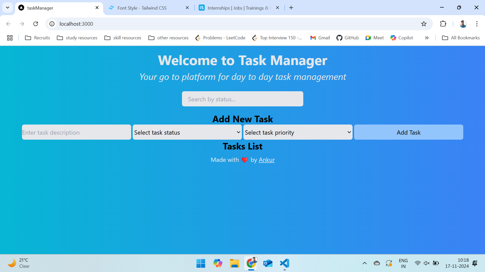
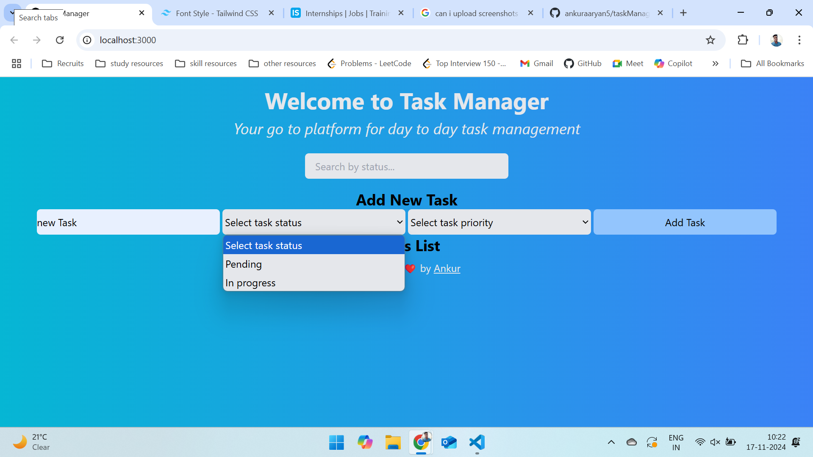
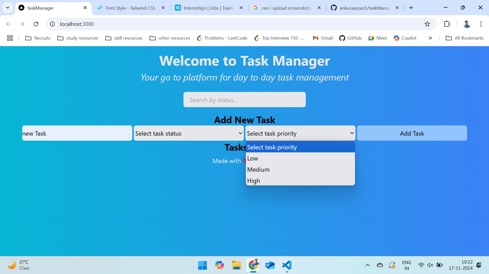
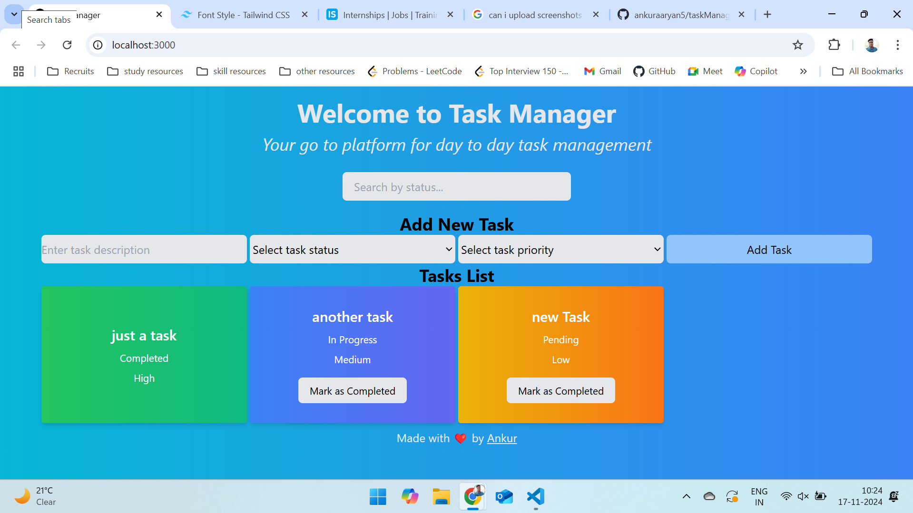

### Task Management Application
This is a simple task management application built using React and Tailwind CSS. The app allows users to add tasks, assign statuses (pending, in progress, completed), and set priorities (low, medium, high). The tasks are stored locally in the browser using localStorage.

## Features
1) Add New Task: Users can add a new task with a description, status, and priority.
2) Status and Priority: Each task has a status (pending, in progress, completed) and a priority (low, medium, high).
3) Task List: Displays all tasks in a list with different background colors based on their status.
4) Mark as Completed: Users can mark tasks as completed, which updates the task's status.
5) Responsive Design: The form and task list are responsive, adapting to different screen sizes.

# Screenshots
 

